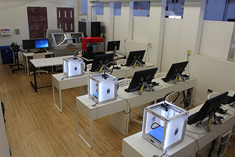

## About FABLAB
A fab lab (fabrication laboratory) is a small-scale workshop offering digital fabrication.
A fab lab is typically equipped with an array of flexible computer-controlled tools that cover several different length scales and various materials, with the aim to make "almost anything". This includes technology-enabled products generally perceived as limited to mass production.

### Fablab MESCE
"FabLab - MESCE” is digital manufacturing technology, combininig 2D and 3D design with the latest fabrication technology. Embracing a broad spectrum of methods ranging from CNC machining to 3D printing, and even PCB Milling.

## About me
I'm Ashbin Ashraf pursuing my B.tech Mechanical Engineering at MESCE Kuttippuram.
Contact me:ashbinashraf@gmail.com
           8606664889        


# Header 1
## Header 2
### Header 3

- Bulleted
- List

1. Numbered
2. List

**Bold** and _Italic_ and `Code` text

[Link](url) and 
```

For more details see [GitHub Flavored Markdown](https://guides.github.com/features/mastering-markdown/).

### Jekyll Themes

Your Pages site will use the layout and styles from the Jekyll theme you have selected in your [repository settings](https://github.com/ashbinashraf/ashbinashraf.github.io/settings). The name of this theme is saved in the Jekyll `_config.yml` configuration file.

### Support or Contact

Having trouble with Pages? Check out our [documentation](https://help.github.com/categories/github-pages-basics/) or [contact support](https://github.com/contact) and we’ll help you sort it out.
